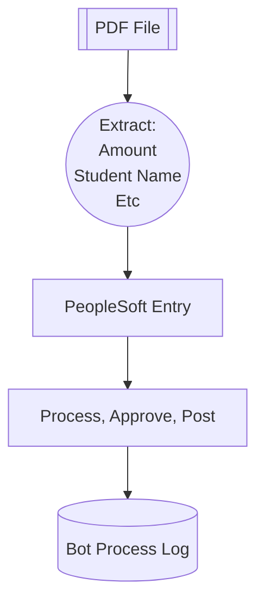

## KHEDU Journal Processing Bot

Start with a PDF file from Ed foundation Superintendent's office via email

High level plan is to:
- [X] Agentic extraction of PDF information:
    - Amount
    - Student Name
    - Type (eg Project Best)
    - Transfer Description
- [ ] Additional Agent to get resource code based on account name from prior agent and resource list tool?
- [ ] PeopleSoft Entry via Playwright
- [ ] Process Entry via Playwright
- [ ] Record activity log

