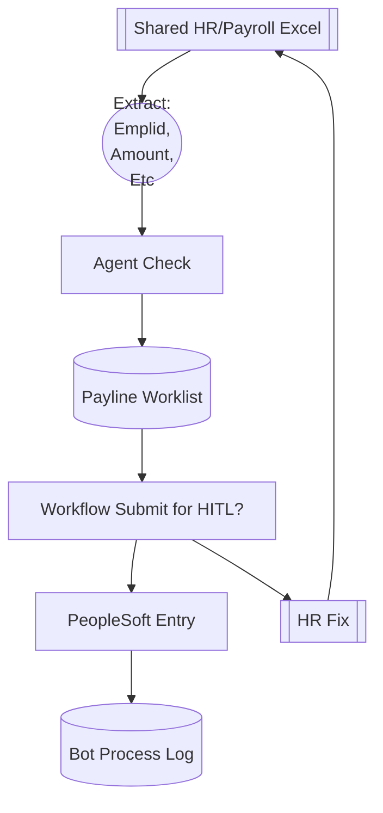

## Payroll Payline Processing Bot

Start with the shared Excel file from HR via network share/sharepoint folder

High level plan is to:
- [ ] Agentic (or scripted) extraction of excel information:
    - Amount
    - Employee detail
    - Type (eg Earnings, Deduction)
    - Codes, dates, etc
    - [X] Agentic Identification of tabs of interest (multiple in HR files)
    - [X] Build a log of what is done/potentially done, tools to check status updated db
    - [X] Load rows from agent into db (upsert safe dont overwrite existing)
    - [ ] SQL from stephen to check emplid/amount is loaded/not loaded (update db status)
    - [ ] Update excel with 'entered' or some checkmark to indicate processing status?
- [ ] Agentic calc/sanity check
- [ ] PeopleSoft Entry via Playwright
- [ ] Submit to workflow (Rishi to build in QA) via Playwright
- [ ] Record activity log
